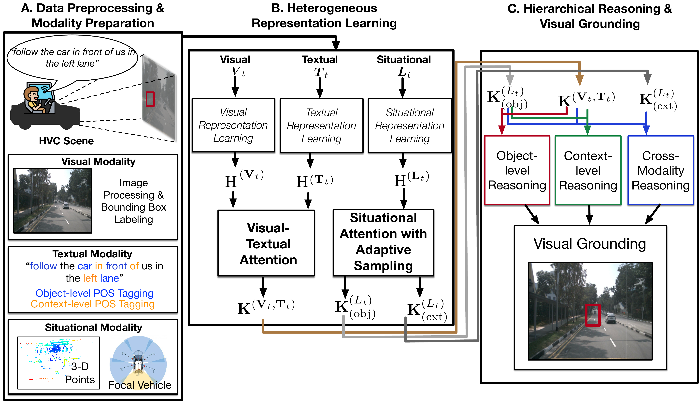
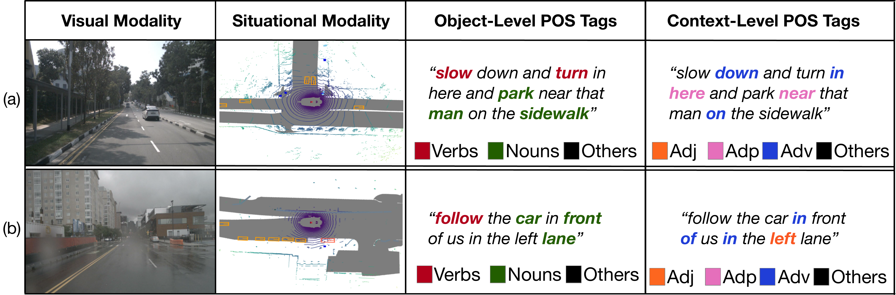

# VIGOR: Visual Grounding via Heterogeneous Representation Learning and Hierarchical Reasoning of Human-to-Vehicle Commands

Official materials for the ICRA 2026 paper:

**Visual Grounding via Heterogeneous Representation Learning and Hierarchical Reasoning of Human-to-Vehicle Commands (VIGOR)**

## Overview

VIGOR studies visual grounding for human-to-vehicle commands. This repository folder will collect the paper presentation materials, citation information, and future project resources.


## Figures
### Figure 1: System Overview




### Figure 2: POS-Tag Data Visualization




## TODO List

- [x] Initial Repo


## Abstract

With the proliferation of autonomous vehicles (AVs) and their increasing interaction and communication with riders, grounding or locating the visual objects of interest (OoIs), such as concerned pedestrians and other traffic participants, based on human riders' natural language communication, e.g., vocal commands, is essential for increasing the efficiency, effectiveness, reliability, and safety of AVs in following riders' reasonable commands and preferences.

There are several technical challenges in achieving visual grounding for such human-to-vehicle commanding (HVC) scenes, including: (1) how to fuse heterogeneous sensor modalities, i.e., visual object information, textual contexts, and situation awareness, such as information obtained from light detection and ranging; (2) how to discern opaque commands in human natural language; and (3) how to reason about the relative positions of the OoIs within the visual modality.

To meet these challenges, we propose VIGOR, a visual grounding approach based on heterogeneous modality learning and hierarchical reasoning for HVC scenes. First, we design a heterogeneous modality learning approach to incorporate visual, textual, and situational modalities, and learn their cross-modality representations to identify important information for visual grounding. Then, VIGOR performs hierarchical reasoning at the object and context levels, and differentiates the OoIs in complex traffic environments that relate to natural language commands.

Finally, we conduct extensive experimental studies on a total of 12,037 HVC scenes, demonstrating that VIGOR achieves higher accuracy than state-of-the-art approaches, often by more than 14.81%, in terms of Intersection over Union (IoU) in grounding the OoIs in complex HVC scenes, including low-visibility scenes.

## Citation

If you find this work useful, please cite:

```bibtex
@inproceedings{vigor2026visual,
  title     = {Visual Grounding via Heterogeneous Representation Learning and Hierarchical Reasoning of Human-to-Vehicle Commands},
  author    = {Wang, H. and He, S. and Shin, K. G.},
  booktitle = {Proceedings of 2026 IEEE International Conference on Robotics and Automation (ICRA)},
  address   = {Vienna, Austria},
  month     = jun,
  year      = {2026},
  note      = {June 1-5, 2026}
}
```